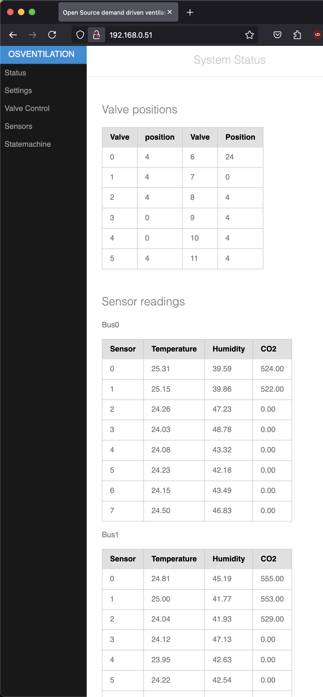
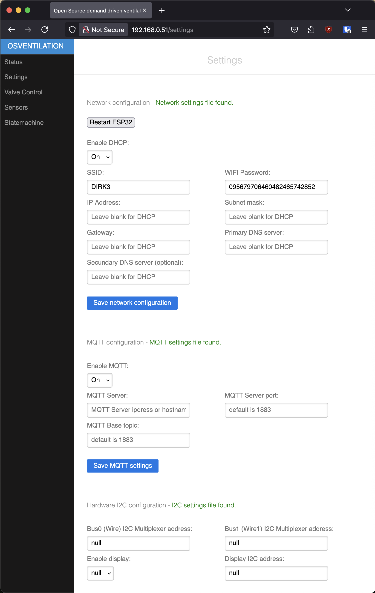
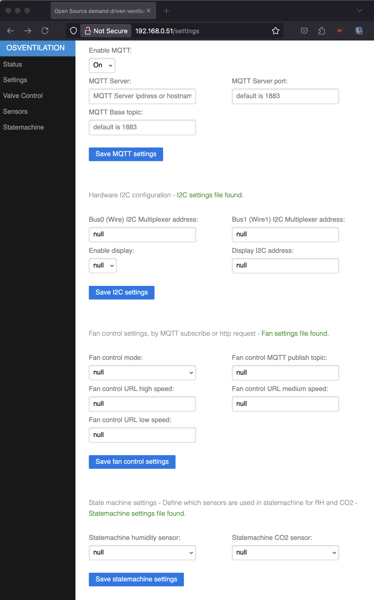
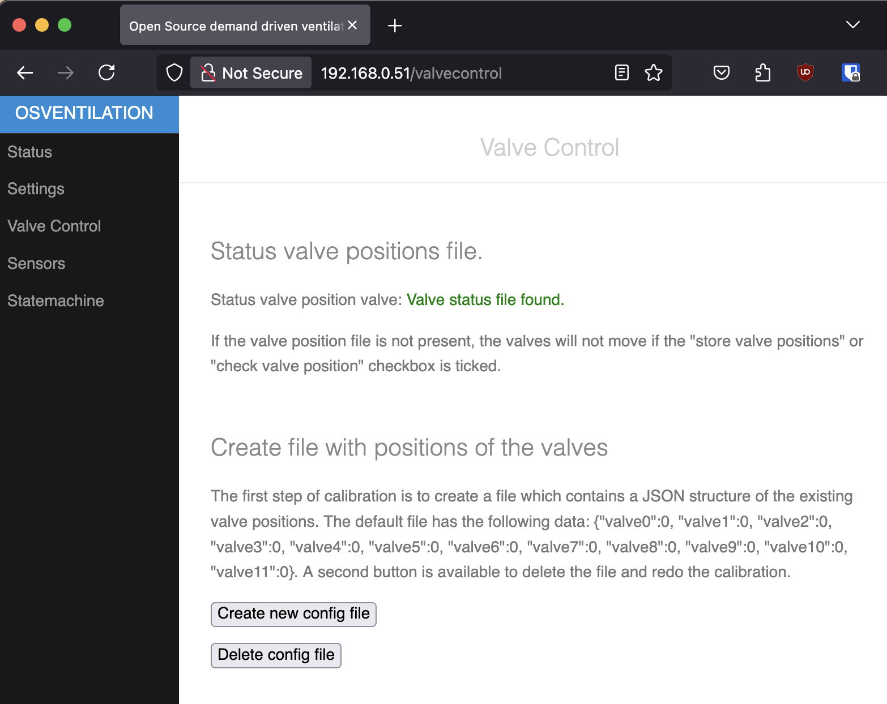
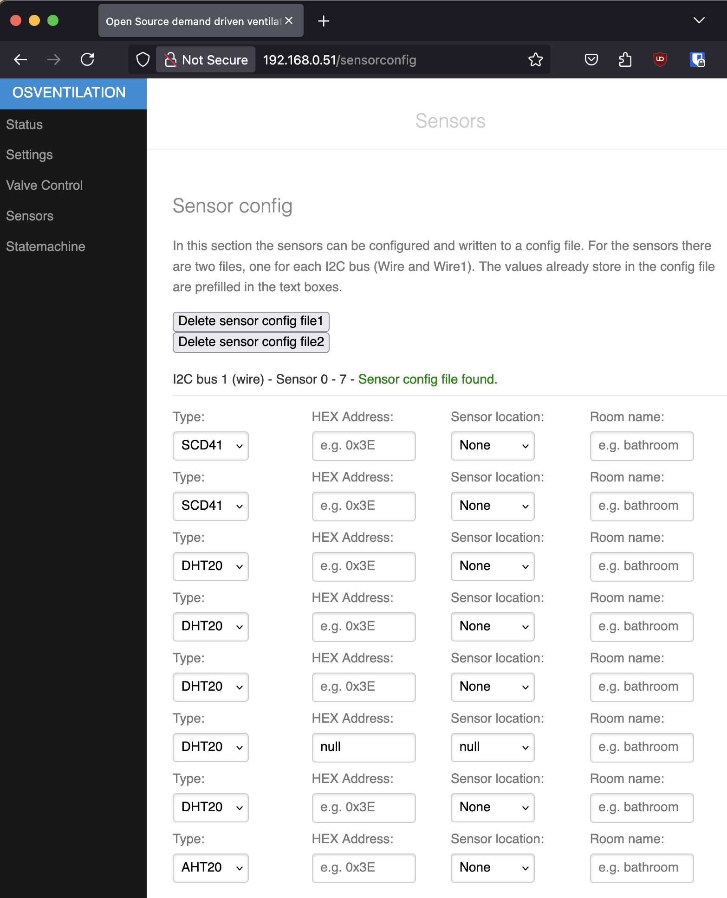
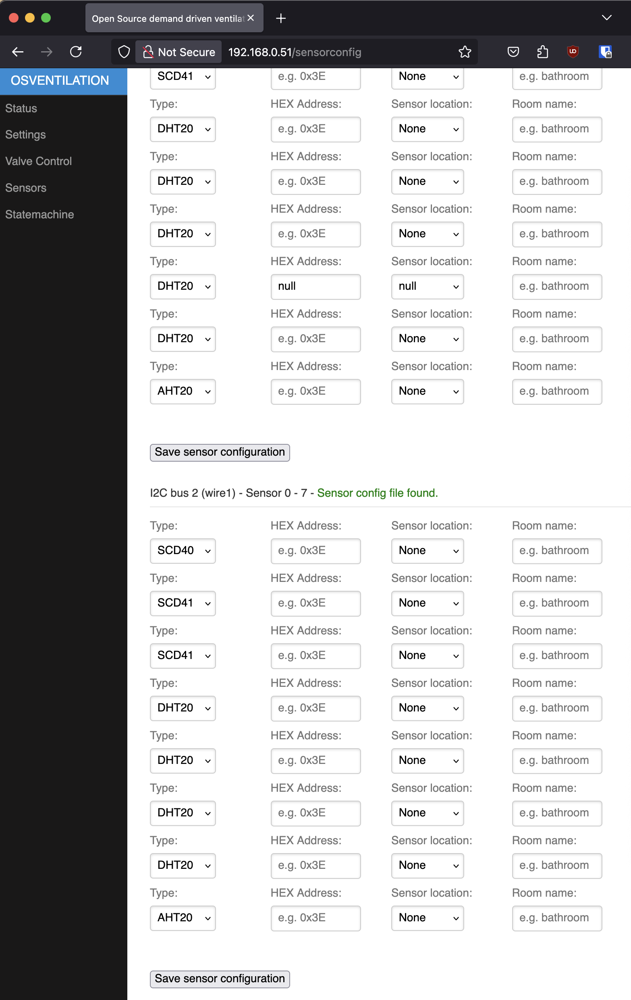

# Open source demand controlled ventilation system #
## Introduction
This project is intended as a replacement of the Itho demandflow controller. The reason that this project was started because my controller at home was behaving strange, the transformer and fuse failed and it is expensive to replace. With modern microcontrollers it should be relatively easy to make a controller for such a system. This project is inspired by the orignal Itho controller but not intended to be an exact copy of the Itho controller. 

The basis for this design is:
* Speed of Itho fan can be controlled by either MQTT or HTTP API with settings Low, Medium and High 
* The controller has 12 channels for 12 Itho valves of type DemandFlow Klep (545-7100). The interface is identical.
* This controller can be a 1:1 replacement
* The system must be modular, e.g. it is not required to add the display, a different RTC could be used, the number of sensors can be 
* The software must be open source
* The hardware must be open source

## Hardware design
The hardware design is based on common electronic parts. The basis of the design:
* Microcontroller ESP32-S3 or ESP32. The design is with the ESP32-S3 soldered on the board but one could also choose to install an ESP32 microcontroller through the 30-pin interface
* 74HC595 for multiplication of processor I/O. Each valve has 4 coils to control and therefore 4 outputs are required per valve. In total 48 outputs are required. The 74HC595 are divided in two groups enabling scaling down to 6 valves for smaller houses
* I2C interface for: 
    * up to 16 sensors
    * Display (4x20 characters LCD with I2C backpack)
    * Realtime Clock
* Use of two I2C busses, Wire and Wire1:
    * Wire: Bus 0 sensors and LCD
    * Wire1: Bus1 sensors and RTC
* Connection to sensors through I2C multiplexer (TCA...) enabling the use of I2C sensors with fixed I2C addresses
* Addressable RGB LEDs for status
* Accurate RTC with battery backup because most actions are time based
* Single 15V power supply with on-board 3.3V and 5V convertors (1A capacity each)
* Operation of sensors on 5V or 3.3V. Data communication always on 3.3V
* MOSFET output drivers for low on state resistance. Alternatively ULN2803 could used as well (pin compatible)

## Software design
The software is written in PlatformIO with the standard Arduino framework for ESP32 and ESP32-S3. Few additional libraries are required for web interface, MQTT, InfluxDB, sensors, RGB LEDS, displays and RTC.

The software uses FreeRTOS functions availabe in the arduino framework. The software is modular because most functions are written as individual tasks. It should be possible to run the software without WiFi connection but with reduced functionaltiy.

The software has the following tasks:
* Task_web - Async webserver for configuration and monitoring of the system
* Task statemach - Statemachine to control different operating mode based on sensor readings or time
* Task influxdb - InfluxDB client for storing sensor data, system operating states and system/debug information 
* Task MQTT - MQTT Client to publish sensor data, system operating states and system/debug information and fan control (option)
* Task Neopixel - Control of 2 RGB LEDs for system status and fan speed
* Task valve control - Control of position of the 12 valves
* Task Wifi - Wifi manager. In the initial setup the ESP32(-S3) will be the access point. Once the Wifi has been configure it will connect to an access point with DHCP or manually configured
* Task I2C - Task to control all I2C devices

The following external  libraries are required:
* ESP32Async/ESPAsyncWebServer
* ESP32Async/AsyncTCP
* ArduinoJson
* DHT20
* adafruit/Adafruit BusIO
* sensirion/Sensirion Core
* sensirion/Sensirion I2C SCD4x
* RTClib
* Ethernet
* HttpClient
* tobiasschuerg/ESP8266 Influxdb
* yiannisbourkelis/Uptime Library
* adafruit/Adafruit NeoPixel

There are two libraries included in the source:
* PubSubClient
* LiquidChristal_I2C

The library LiquidChristal_I2C is fixed to Wire interface. The display is connected to Wire1 and therefore a moficiation to the source file was required and included in the source. The PubSubClient is the original MQTT client written by Nick O'Leary (http://knolleary.net).

## Web interface

### Status interface

This is the root page providing an overview of the sensor readings.

### Settings

General settings for the system.

#### Network settings
With empty settings the controller will start as an access point. With a mobile phone or tablet a WIFI connection can be made to "OSVENTILATION-WIFI". Once connected the webinterface can be reached on http://192.168.4.1

To be able to connect the controller to an existing Wifi access point both the SSID and WIFI password must be filled in and the following choice must be made:
* DHCP (default and suitable for most users)
* Manual network configuration

For DHCP mode the dropdown menu must set to "On" (default). If DHCP is set to off then all other field must be filled in order to make a proper manual Wifi connection. If only one DNS server is available then fill the same IP address in for both fields. There is no check on the validity of the filled in data so make sure the data is correct!

Save the settings and reboot the controller with the "Restart ESP32" button.

#### MQTT Settings

Fill in this section to enable and configure MQTT. The default setting is MQTT off with empty settings. The minimum settings are "Enable MQTT" to "On", the MQTT IP address and the base topic <b>(what happens if this is left blank)???</b>. If the MQTT server port is left empty then the default port of 1883 is assumed. 

The settings will become active as soon as the "Save settings" button is pressed. No need to reboot the controller.

#### I2C Settings

In this section the I2C address of both I2C multiplexers are specified. If left empty the default (0x62) is used. If for some reason a different address is chosen by installing resistors R../R../R.. for bus0 or R../R../R.. for bus1 fill in the I2C settings

In these settings the LCD can be enabled and the address can be filled in. If enabled without filling in the I2C address, the default address (0x62) is assumed.

### Valve Control

Valve control - Calibration and control of the valves.

### Sensors

Sensor settings.

### Statemachine

Settings for the statemachine.

## InfluxDB Data Structure

In the settings file the bucket can be configure. In this bucket the following structure wiull be used:

Measurement and fields:
* Sensors
    * temperature
        * bus0
            * Sensor0
            * ...
            * Sensor7
        * bus1
            * Sensor0
            * ...
            * Sensor7
    * humidity
        * bus0
            * Sensor0
            * ...
            * Sensor7
        * bus1
            * Sensor0
            * ...
            * Sensor7
    * CO2
        * bus0
            * Sensor0
            * ...
            * Sensor7
        * bus1
            * Sensor0
            * ...
            * Sensor7
* Sesnosrs_avg
    * Same stucture as instantenious sensor readings
* Status
    * fanspeed
    * state
* System
    * Uptime
* System_stats
    *
* Valves
    * position
        * valve0
        * ...
        * valve11

## Comissioning and initial startup

